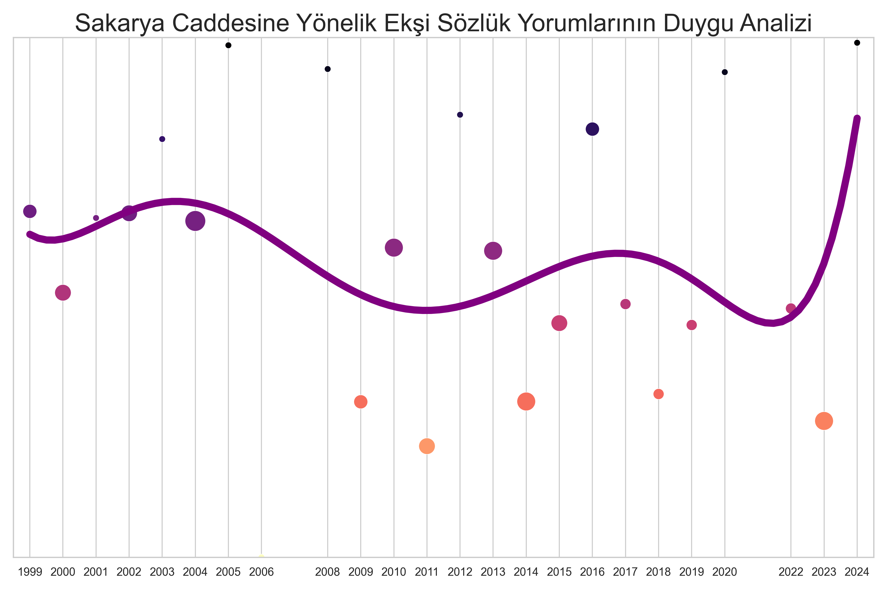
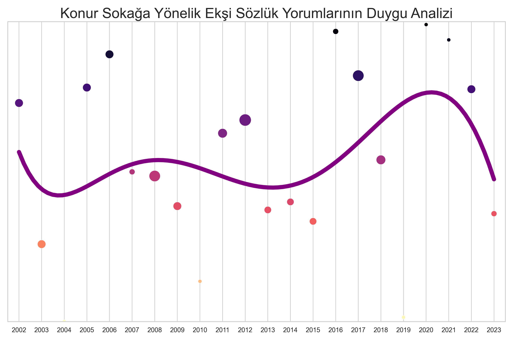
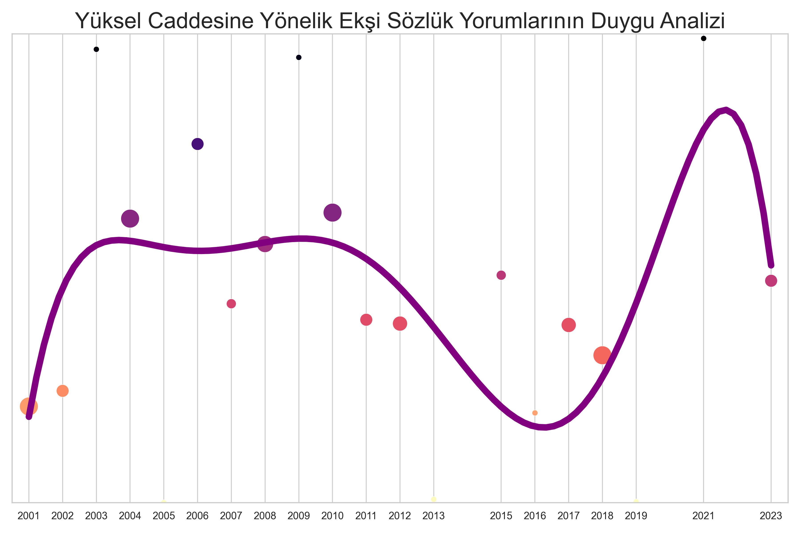

# Giriş

Bu çalışma Şehir Plancıları Odası Ankara Şubesinin 2024 yılında düzenlediği **Arada Bir Yerde Ankara** sergisi kapsamında **Kent Merkezlerinin Değişim/Dönüşüm Sürecinde Arada Bir Yerde Sokak Deneyimleri** atölyesi kapsamında hazırlanmıştır.

# Kullanım

Gerekli kütüphaneleri kurduktan sonra **main.py** dosyasını çalıştırıp başlığın adını yazmanız yeterlidir.